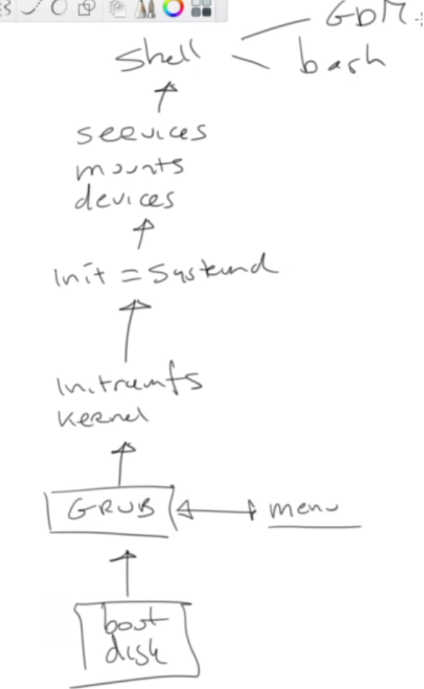

# Boot Procedure

## Grub
The location of Grub depends if you are running a BIOS system or en EFI system.

#### For EFI

/boot/efi

#### For BIOS

To make static changes to Grub edit "/etc/default/grub".
Commit the changes you make. ``grub2-mkconfig -o /boot/grub2/grub.cfg``

