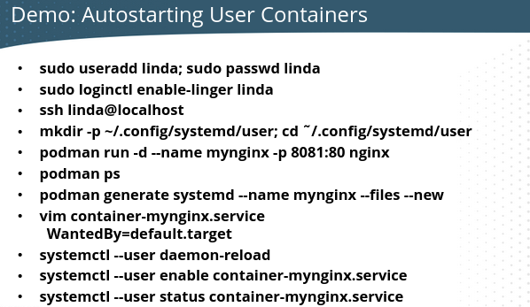

# Container management

First install the container tools.

``dnf install container-tools``

## Registries

After the install we have "/etc/containers". There we have for example, "registries.conf". Here we can set the registries it uses for images. The line is: "unqualified-search-registries =".

Use ``podman login registry.redhat.io`` to login to Red Hat's registry.
Use ``podman login registry.redhat.io --get-login`` to get your current login credentials.

Users can have their own "registries.conf" file in "~/.config/containers/registries.conf".

Search your registries for an image.
``podman search alpine``

Manage and inspect images no matter where they are.
``skopeo inspect docker://path-to-image``

## Container File

To automate container builds. What we want in our container image.

## General Commands

``podman info``

### List downloaded images
``podman images``

### List running containers
``podman container ps``

### List all containers
``podman container ps -a``
``podman container list –all``

### Get CPU and Memory usage for your containers
``podman stats``

``podman diff``

## Working with images

### Pull an image
``podman pull fedora:latest``

### List images
``podman images``
You can also do, ``podman image ls``

### Inspect image
``podman image inspect image-id or image name``

### Remove Image
``podman image rm "imageid"``

### Tag image
``podman image tag nginx:latest nginx:version1``  

### Push image

**First you need to login to docker.**

First you need to tag your image with your username for hub.docker.com and then the repo name.
``podman image tag nginx:latest 1980is/nginx``
The username for Docker Hub is 1980is, and the repo that's created is nginx. Let's push this image.
``podman push 1980is/nginx``

To understand this better, let's pull a random image first. After that, let's list our images, tag it and upload to Docker.

1. ``podman pull alpine``
2. ``podman images``
3. ``podman tag alpine:latest 1980is/alpine1`` The tag "alpine:latest" is the image we want to use. "1980is/alpine1", the 1980is is my DockerHub username and "alpine1" is the repository I want to use. 
4. ``podman push alpine/alpine1`` This pushes the image into the alpine1 repository with the name latest.

Let's say you want to use another tag than "latest".

1. ``podman tag alpine:latest 1980is/alpine1:broken`` This tags the alpine:latest image as "broken" and uses the alpine1 repository.
2. ``podman push 1980is/alpine1:broken``

### Image history.
To see the image layers.
``podman image history nginx``

## Working with containers

### Run container
``podman container run -dit --name fedora-v1 fedora``
-d stands for detached mode. -i stands for interactive and -t stands for terminal. --name names the instance, you don't have to provide a name, then Docker will create a random name for the container. Fedora without any tags behind it, e.g., fedora:36, will make Docker pull the latest Fedora image, the equivalent of writing fedora:latest.

``podman run -d -p 8080:80 --name nginxtest  nginx:latest``

``podman container run --name webserv2 -d -p 9002:80 nginx``
This runs an nginx container named webserv1 in detached mode on port 9002. To check it out run http://localhost:9002/ in your browser.

Create a container running MariaDB.
``podman run --detach --network podman --name some-mariadb --env MARIADB_USER=example-user --env MARIADB_PASSWORD=my_cool_secret --env MARIADB_ROOT_PASSWORD=my-secret-pw  mariadb:latest``

### Connect to container
Connect to fedora-v1. 
``podman attach fedora-v1`` 

Connect to MariaDB container named some-mariadb.
``podman exec -it some-mariadb mariadb -uroot -pmy-secret-pw``

### Detach from container
Press detach key sequence "**ctrl-p, ctrl-q**"

### Auto-Start Containers

To automatically start containers in a stand-alone situation, you can create a systemd user unit files for rootless containers and manage them with systemctl.

If Kubernetes or OpenShift is used, containers will be automatically started by default.

Systemd user services start when a user session is opened, and closed when the user session is stopped. Use ``loginctl enable-linger`` to change that behavior and start user services for a specific user (requires root privileges).

``loginctl enable-linger armann``
``loginctl show-user armann``
``loginctl disable-linger armann``

Create a regular user account to manage containers. Use ``podman`` to generate a user systemd files for an existing container.

First we should create this folder structure. ``mkdir ~/.config/systemd/user; cd ~/.config/systemd/user``

Notice the file will be generated in the current directory.
``podman generate systemd --name myweb --files --new``
To generate a service file for a root container, do it from "/etc/systemd/system/" as the current directory.

The ``podman generate --new`` option will create a new container when the systemd unit is started, and delete that container when the unit is stopped.

Use ``podman generate`` to create a user-specific unit files in "~/.config/systemd/user". Edit the file that is generated and change the "WantedBy" line so it reads "WantedBy=default.target"

Manage them using ``systemctl --user``
``systemctl --user daemon-reload``
``systemct --user enabel myapp.service (requires linger)
``systemctl --user start myapp.service``

**``systemctl --user`` commands only work when logging in on console or SSH and do not work in sudo and su sessions.**

### Connect to a running container
``podman exec -it fedora-v1 bash``
To disconnect from the container write ``exit``.

### Stop container
``podman container stop fedora-v1``

### Kill container
``podman container kill fedora-v1``
When stopping doesn't work, you can kill the container.

### Remove Container
``podman rm "containerid"``

This command removes **all** stopped containers.
-a stands for all containers. -q returns only the container id.
``podman container ps -aq | xargs docker rm``

### Environment variables

When you need to pass information when you are building the container, you use environment variables. For instance when installing MariaDB. It needs a root password. You can do it this way.

``podman run --name mydb -e MYSQL_ROOT_PASSWORD=password quay.io/centos7/mariadb-103-centos7``

## Container Network

``podman network list``
``podman network inspect``
``podman network inspect bridge``

### Port Mapping 

Rootless containers do not have ip's. It use port mappings to communicate with the containers. You expose a specific port on the host that maps to a container.

Port mappings can be set when starting the container, **you cannot change the port after starting the container**.

Remember that rootless containers **can only map to a non-privileged port**. Ports higher than 1024.

## Storage

### Local persistant volume storage 

In Podman the local volumes are created in the home directory.
``podman volume create myvol``
``podman volume inspect myvol``

### NFS

``podman volume create --driver local --opt type=nfs --opt o=addr=192.168.122.36,rw --opt device=:/nfsdata nfsvol``

Run a container that uses that NFS storage.   
``podman run -it --name voltest2 --rm --mount source=nfsvol,target=/data nginx sh``

## Rootless Containers Port Mapping

To set appropriate directory ownership on bind-mounted directories for rootless containers, additional work is required. First, find the UID of the user that runs the main application. You may be able to find this using ``podman inspect imagename`` otherwise use, ``podman exec containername grep username /etc/passwd``

Use ``podman unshare chown nn:nn directoryname to set the container UID as the owner of the directory on the host.``

Notice that directory name **must be in the user home directory** because otherwise it wouldn't be part of the user namespace.

Use ``podman unshare cat /proc/self/uid_map`` to verify mapping.

Verify the mapped user is owner on the host, using ``ls -ld /directoryname``

## Namespaces

## SELinux

As file ownership has been taken care of in the preceding steps in "Rootless Containers", you are now ready to bind mount, taking care of SELinux as well.

``podman stop mydb``
``podman rm mydb``
``podman run -d --name mydb -e MYSQL_ROOT_PASSWORD=password -v /home/student/mydb:/var/lib/mysql:Z quay.io/centos7/mariadb-103-centos7``
``ls -Z /home/student``

## Debug

### Inspect container
``podman container inspect fedora-v1``
See container information. You can use the container name or container id.
``
### View container logs
``podman container logs fedora-v1``

