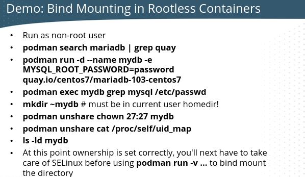

# Container management

First install the container tools.

``dnf install container-tools``

## Registries

After the installation we have "/etc/containers". There we have for example,
"registries.conf". Here we can set the registries it uses for images. The line is: "unqualified-search-registries =".
I recommend adding "quay.io" to the registry list.

Use ``podman login registry.redhat.io`` to login to Red Hat's registry.
Use ``podman login registry.redhat.io --get-login`` to get your current login credentials.

Users can have their own "registries.conf" file in "~/.config/containers/registries.conf".

Search your registries for an image.
``podman search alpine``

Manage and inspect images no matter where they are.
``skopeo inspect docker://path-to-image``

## Container File

To automate container builds. What we want in our container image.

## General Commands

``podman info``

### List downloaded images
``podman images``

### List running containers
``podman container ps``

### List all containers
``podman container ps -a``
``podman container list –all``

### Get CPU and Memory usage for your containers
``podman stats``

``podman diff``

## Working with images

### Pull an image
``podman pull fedora:latest``

### List images
``podman images``
You can also do, ``podman image ls``

### Inspect image
``podman image inspect image-id or image name``

### Remove Image
``podman image rmi "imageid"``

### Tag image
``podman image tag nginx:latest nginx:version1``  

### Push image

**First you need to log in to docker.**

First you need to tag your image with your username for hub.docker.com and then the repo name.
``podman image tag nginx:latest 1980is/nginx``
The username for Docker Hub is 1980is, and the repo that's created is nginx. Let's push this image.
``podman push 1980is/nginx``

To understand this better, let's pull a random image first. After that, let's list our images, tag it and upload to Docker.

1. ``podman pull alpine``
2. ``podman images``
3. ``podman tag alpine:latest 1980is/alpine1`` The tag "alpine:latest" is the image we want to use. "1980is/alpine1", the 1980is is my DockerHub username and "alpine1" is the repository I want to use. 
4. ``podman push alpine/alpine1`` This pushes the image into the alpine1 repository with the name latest.

Let's say you want to use another tag than "latest".

1. ``podman tag alpine:latest 1980is/alpine1:broken`` This tags the alpine:latest image as "broken" and uses the alpine1 repository.
2. ``podman push 1980is/alpine1:broken``

### Image history.
To see the image layers.
``podman image history nginx``

## Working with containers

### Run container
``podman container run -dit --name fedora-v1 fedora``
-d stands for detached mode. -i stands for interactive and -t stands for terminal. --name names the instance, you don't have to provide a name, then Docker will create a random name for the container. Fedora without any tags behind it, e.g., fedora:36, will make Docker pull the latest Fedora image, the equivalent of writing fedora:latest.

``podman run -d -p 8080:80 --name nginxtest  nginx:latest``

``podman container run --name webserv2 -d -p 9002:80 nginx``
This runs a nginx container named webserv1 in detached mode on port 9002. To check it out run http://localhost:9002/ in your browser.

Create a container running MariaDB.

``podman run --detach --network podman --name some-mariadb --env MARIADB_USER=example-user --env MARIADB_PASSWORD=my_cool_secret --env MARIADB_ROOT_PASSWORD=my-secret-pw  mariadb:latest``

### Connect to container
Connect to fedora-v1. 
``podman attach fedora-v1`` 

Connect to MariaDB container named some-mariadb.
``podman exec -it some-mariadb mariadb -uroot -pmy-secret-pw``

### Detach from container
Press detach key sequence "**ctrl-p, ctrl-q**"

### Connect to a running container
``podman exec -it fedora-v1 bash``
To disconnect from the container write ``exit``.

### Stop container
``podman container stop fedora-v1``

### Kill container
``podman container kill fedora-v1``
When stopping doesn't work, you can kill the container.

### Remove Container
``podman rm "containerid"``

This command removes **all** stopped containers.
-a stands for all containers. -q returns only the container id.
``podman container ps -aq | xargs docker rm``

### Environment variables

When you need to pass information when you are building the container, you use environment variables. For instance when installing MariaDB. It needs a root password. You can do it this way.

``podman run --name mydb -e MYSQL_ROOT_PASSWORD=password quay.io/centos7/mariadb-103-centos7``

## Auto-Start Containers

### Explanation

To automatically start containers in a stand-alone situation, you can create a systemd user unit files for **rootless containers** and manage them with systemctl.

If Kubernetes or OpenShift is used, containers will be automatically started by default.

Systemd user services start when a user session is opened, and closed when the user session is stopped. Use ``loginctl enable-linger`` to change that behavior and start user services for a specific user (requires root privileges).

``loginctl enable-linger armann`` \
``loginctl show-user armann`` At the top it lists "Linger: yes" if it's enabled. \
``loginctl disable-linger armann``

First we should create this folder structure in the home directory of the user that will
be running the container.

``mkdir ~/.config/systemd/user; cd ~/.config/systemd/user``

The systemd unit file needs to be generated in the "~/.config/systemd/user" so you must be
in that directory when you run the command.

``podman generate systemd --name myweb --files --new``

To generate a service file for a **root container**, do it from "/etc/systemd/system/" as the current directory.

The ``podman generate --new`` option will create a new container when
the systemd unit is started, and delete that container when the unit is stopped.
That's why you should always use the --new option. **Use the --new option on the exam!**

Edit the file that is generated and change the "WantedBy" line, so it reads "WantedBy=default.target". Otherwise you will run into issues.

Manage them using: \
``systemctl --user daemon-reload`` \
``systemct --user enable myapp.service`` (requires linger) \
``systemctl --user start myapp.service``

**``systemctl --user`` commands only work when logging in on console or SSH and do not work in sudo and su sessions.**

### Steps

1. Create the user, must have a passwd.
   2. ``useradd rambo; passwd rambo``
2. We need to enable linger for the rambo user.
   4. ``loginctl enable-linger rambo``
3. SSH into the server.
   4. ssh ``rambo@localhost``
4. Create the directory that Podman will write the systemd unit file to.
Remember you must be in the folder when you run podman generate systemd, hence the cd command.
   6. ``mkdir -p ~/.config/systemd/user; cd ~/.config/systemd/user``
5. Let's create and start the container we want systemd to automatically start.
   8. ``podman run -d --name webmaster -p 8089:80 nginx``
6. Now we need to generate the systemd unit file.
   10. ``podman generate systemd --name webmaster --files --new``
7. This will create the "container-webmaster.service" file. Next we need to
check the file and make sure that wanted by is default.target. "WantedBy=default.target"
   12. ``vim container-webmaster.service ``
8. Next we need to reload the user daemon.
   9. ``systemctl --user daemon-reload`
9. Let's enable the service we created.
   10. ``systemctl --user enable container-webmaster.service``
11. Let's check the status of the service. It should be enabled but not running.
    12. ``systemctl --user status container-webmaster.service``
13. To see if it worked we must reboot the server. Once the reboot is over, check if you
see the nginx process running under user rambo. You can also ``curl localhost:8089``
    14. ``ps faux | less`` Look for processes under user rambo.

## Container Network

``podman network list``
``podman network inspect``
``podman network inspect bridge``

### Port Mapping 

Rootless containers do not have ips. It uses port mappings to communicate with the containers. You expose a specific port on the host that maps to a container.

Port mappings can be set when starting the container, **you cannot change the port after starting the container**.

Remember that rootless containers **can only map to a non-privileged port**. Ports higher than 1024.

## Storage

### Local persistent volume storage 

In Podman the local volumes are created in the home directory.
``podman volume create myvol``
``podman volume inspect myvol``

You can create persistent storage with creating a directory on the container
host and bind-mounting it to the container. Keep in mind that file ownership is important
when bind-mounting directories on the host.

If a container is started by the root user, UIDs and GIDs on the host match
the UIDs and GIDs on the container.

For a rootless container, you need to make sure that the UID of the user that
runs the container application is owner of the bind-mounted directory. You can find
out what user is running the container with ``podman inspect imagename``

### NFS

``podman volume create --driver local --opt type=nfs --opt o=addr=192.168.122.36,rw --opt device=:/nfsdata nfsvol``

Run a container that uses that NFS storage.   
``podman run -it --name voltest2 --rm --mount source=nfsvol,target=/data nginx sh``

## Rootless Containers - NEEDS WORK

See "Auto-Start Containers" section above.

### Non-root User Mappings

To bind-mount directories for rootless containers find the UID of the user
that runs the main application with ``podman inspect imagename``

``podman unshare chown user:grp directoryname`` to set the container UID as the 
owner of the directory on the host. The directory name **must be** in the user
home directory because otherwise it wouldn't be a part of the user namespace!

Use ``podman unshare cat /proc/self/uid_map`` to verify mapping.

Verify the mapped user is the owner on the host using ``ls -ld /directoryname``

### Port Mapping

To set appropriate directory ownership on bind-mounted directories for rootless containers, additional work is required. First, find the UID of the user that runs the main application. You may be able to find this using ``podman inspect imagename`` otherwise use, ``podman exec containername grep username /etc/passwd``

Use ``podman unshare chown nn:nn directoryname to set the container UID as the owner of the directory on the host.``

Notice that directory name **must be in the user home directory** because otherwise it wouldn't be part of the user namespace.

Use ``podman unshare cat /proc/self/uid_map`` to verify mapping.

Verify the mapped user is owner on the host, using ``ls -ld /directoryname``

#### Bind Mounting in Rootless Containers

# FIX THIS MISSING CONTENT

1. Run as non-root user
2. ``podman run -d --name armann-db -e MYSQL_ROOT_PASSWORD=123456``
3. ``podman exec armann-db grep mysql /etc/passwd`` Note down the UID and GID.
4. ``mkdir armann-db`` Must be in the home directory of the user!
4. ``ls -Z`` To see Selinux label for the directory armann-db.
5. 

### Namespaces

Rootless containers are launched in a namespace. Namespaces provide isolation and
it tries to makes sure that everything in the container is contained to that namespace and is secure.

Namespaces enable access by mapping UIDs between the namespace and the host OS.

## SELinux

As file ownership has been taken care of in the preceding steps in "Rootless Containers", you are now ready to bind mount, taking care of SELinux as well.

``podman stop mydb``
``podman rm mydb``
``podman run -d --name mydb -e MYSQL_ROOT_PASSWORD=password -v /home/student/mydb:/var/lib/mysql:Z quay.io/centos7/mariadb-103-centos7``
``ls -Z /home/student``

## Debug

### Inspect container
``podman container inspect fedora-v1``
See container information. You can use the container name or container id.
``
### View container logs
``podman container logs fedora-v1``

## Notes for myself

Look into machinectl instead of using ``ssh username@localhost``

