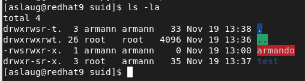

# File Management

## Basic file and folder permsission.

Linux applies permissions in the following order.

1. Owner.
2. Group.
3. Others.

If you are the owner, Linux doesn't check the group or other permissions.

## ACL

*ACL's are not a part of the RHCSA 9 but I still wrote down information about it.*

There are two types of ACL.    
-   The normal ACL. 
-   The default ACL. 

To create an ACL list you use the command ``setfacl``. 

``setfacl -R -m g:sales:rx filename``
``Setfacl -m d:g:profs:rx foldername/``

This sets the group profs as a default group that can read and execute all files creating in foldername in the future.

If fileacl not supported message appears, there is something wrong in the filesystem.

To see the acl.

``getfacl foldername``

---

## SUID, SGID, and Sticky Bit 

To apply SUID, SGID, and sticky bit, you can use chmod. SUID has numeric value 4, SGID has numeric value 2, and sticky bit has numeric value 1. 

**SUID = 4**

It executes as the user that ownes the file. Let's say that root owns a file and John executes that file, it's executed as root, not John. It's dangerous and not recommended practice.

*SUID on directories has no meaning*.  

``chmod u+s filename`` This enables set user id for that file. If Root is the owner. 
You can also set it by using the bits. ``chmod 4775 filename``

To see if the SUID bit is set the permissions is an **s** in the user section.
Looks like this: -rw**s**r--r--

To remove suid, ``chmod u-s filename``

**SGID = 2**

It **inherits** DIR group owner when new files are created. It can good in shared environments.

This enables set group id for that folder.  
``chmod g+s foldername/``
You can also set it by using the bits. ``chmod 2775 foldername/``

To verify that group id is set for a folder, there is an s in the group sections.
drwxrw**s**r-x.

To remove guid, ``chmod g-s foldername/``

If the group has rwx on the directory, that means that any member of the that owns the directory can delete files within that folder. We might not want Melinda to be able to delete files that John creates. That's where sticky bit comes in.

**STICKY = 1** 

*Sticky bit has no meaning on files but it does have meaning on directories*. 

It makes it so that that delete only works if the **owner** deletes it. Read about this problem under the SGID = 2 section. To check who is the owner of the current directory, ``ls -ld .`` You can also see it with the classic ``ls -la`` and it will be the first item listed. As you can see in the picture, the user armann and the group armann is the owner of the current directory. You can also see that the **SUID** bit is set for the file "armando". The **GID** is also set for the folder "test".

This applies a sticky bit to all filed in the current directory.
``chmod +t *``
You can also set it by using the bits. ``chmod 1775 ``

To see if the Sticky Bit is set the permission has a **t** at the end. 
``-rw-r--r-t``

---

## Change ownership

``chown john:john alamo``
This changes the owner and the group on the file/folder alamo.
If you just want to change the group you can do ``chown :john alamo``
You can also use the ``chgrp`` command. ``chgrp john alamo``

## Change permissions

-   0 No permission.
-   1 Execute permission.
-   2 Write permission.
-   3 Write and execute permissions.
-   4 Read permission.
-   5 Read and execute permissions.
-   6 Read and write permissions.
-   7 Read, write, and execute permissions.

This gives the owner full permission, group read and execute permission, and others no permission on "myfile".

``chmod 750 myfile``

This is known as the absolute mode. There is a relative mode that you can use. Let's say I wanted to make myfile executable.

``chmod +x myfile``

---

## UMASK

Type in ``umask`` to see the default umask. Unless you have changed it, it should be "0022". The umask is used to assign default permission for new files and directories.

Default permission for directories is 777. Default permission for files is 666.

To calculate the permission bits for a new file or directory, we subtract the umask value from the default value.

-   666 - 022 = 644
-   777 - 022 = 755

The umask value can be found and configured in the following location.
-   /etc/profile System-wide default variables are stored.
-   /etc/bash.bashrc Default shell configuration files are stored

---