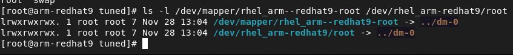
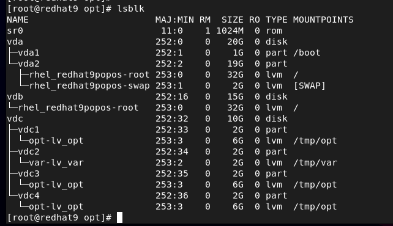

# LVM Management

## Add a new disk to LVM without using partitions

### Step 1
Let's start by scanning the scsi bus. This should discover any newly added disks without rebooting. 

``for D in $(ls /sys/class/scsi_host/) ; do echo "- - -" > /sys/class/scsi_host/$D/scan ; done``

If that does not work you can do this.

``ls /sys/class/scsi_device/``
For everything listed do the following, **edit the numbers** to reflect what's listed on your server.
``echo 1 > /sys/class/scsi_device/0\:0\:0\:0/device/rescan``

### Step 2
Let's add the disk to the physical volume group.
``pvcreate /dev/vdb``

Make sure to **change vdb** for the disk you want to add. A quick way to **find the name of your new disk** is the command ``lsblk``. Let's check to see that it was successfully added. You use the ``pvs`` command to get a short summary about the disks in your physical volume group. To get more information use ``pvdisplay``. The new disk should be listed.

### Step 3 ###
The next step is to add it to a current volume group, or create a new volume group if needed. If you don't know the name of your volume group, use ``vgs`` or ``vgdisplay`` to find it.

To **expand a current volume group**.
``vgextend rhel_redhat9 /dev/vdb`` 

rhel_redhat9 is the name of the volume group you want to expand. Remember **to change** both the name of the volume group and the disk to your specifications. Let's verify that the volume group was increased by the size of the disk that was added to the physical volume group. Use ``vgs`` or ``vgdisplay`` to see that the volume group now has some free space that we can add to a logical volume group.

### Step 4 ###
The last step is to add that free space to a logical volume group. If you don't know the name of your logical volume group, use ``lvs`` or ``lvdisplay`` to find it. Let's add all the free space to our logical volume group.

``lvextend -l +100%FREE /dev/rhel_redhat9/root``

Remember that "rhel_redhat9" is your volume group, and "root" is your logical volume group.
Nextwe need to extend the filesystem on the mounted volume group. To see the filesystem type being used issue ``df -Th``. I am running xfs, to use all of the available space.

``xfs_growfs /dev/mapper/rhel_redhat9-root``

If you are running ext4, you can grow the filesystem with ``resize2fs``.

Remember that it doesn't matter if you use the mapper path or not, both are symbolic links to the same thing.

## Expand a LVM partition

### Step 1 ###
Let's use this setup as an example.
We have the "vdc" disk that has four partitions.
Partition 1, 3 and 4 are all using the "opt" volume group, and "lv_opt" logical volume group.

### Step 2 ###
Let's add 2GB to the 10GB "vdc" disk, and then expand the "vdc4" partition using all that extra space.

**Let's use fdisk since the disklabel type is dos for the "vdc" disc. If the disklabel type is gpt, use gparted instead of fdisk.** You can see the disklabel type with ``fdisk -l``.

### Step 3 ###

``fdisk /dev/vdc``

Press "p" to print out the partition tables. Let's expand the last primary partition, "vdc4". Let's **check the free unpartitioned space** by pressing "F". If you are using an old version of fdisk, "F" will not be an option.

Here is the scary part, **we must delete the partition and recreate it** using the new size that we want. As you can see the vdc4 partition is 2G in size. Let's add 2GB to it and make it 4GB.

In fdisk, press "d" and select the partition you want to delete.

Let's re-create the partition by pressing "n." Press "enter" and select the default first sector.

For me it's going to be a primary parition number 4 and I select the default first sector that is proposed.

The disk was originally 2GB and I want to add 2GB to the disk, I will write +4GB when it prompts me in the next step. If you want to use all of the space, just press "enter".
Last sector, +/-sectors or +/-size{K,M,G,T,P} (12584960-52428799, default 52428799): **+4G**

It asked me. "Do you want to remove the signature? [Y]es/[N]o:" I pressed N. **Since we are resizing a partition we must certainly want to keep it.**

Press "w" to write the information to disk. Now vdc4 has 4GB instead of 2GB.

### Step 4 ###

Let's add it to LVM.  ``pvresize /dev/vdc4`` Let's verify the free space ``pvs``

If you run ``vgs`` you can see that the "ops" volume group now has free space since the vdc4 partition was allocated to the "ops" volume group.

### Step 5 ###

Now we extend the logical volume group "lv_opt". 
``lvextend -l +100%FREE /dev/opt/lv_opt``

### Step 6 ###

Grow the filesystem.
``xfs_growfs /dev/mapper/opt-lv_opt``

## Create a volume group and a logical volume group ###

### Step 1 ###

Add the disk or partition to the physical volume group. Change vdc1 for your disk/partition.
``pvcreate /dev/vdc1`` 

### Step 2 ###

Let's create the volume group named "var" using /dev/vdc1.
``vgcreate var /dev/vdc1``

### Step 3 ###

Let's create the logical volume group named "lv_var" and use all of the space available from the "var" volume group we just created. 
``lvcreate -n lv_var -l 100%FREE var``

### Step 4 ###

Now we need to add a filesystem to our logical volume.
``mkfs.xfs /dev/var/lv_var``

### Step 5 ###

Mount the filesystem. Change /tmp/var for whatever you are using.
``mount /dev/var/lv_var /tmp/var/``
Mount it using /etc/fstab if you want the mount to survive a reboot. In /etc/fstab, this would mount the lv_var in the /tmp/var directory.

``/dev/opt/lv_var	/tmp/var				xfs	defaults	0 0``