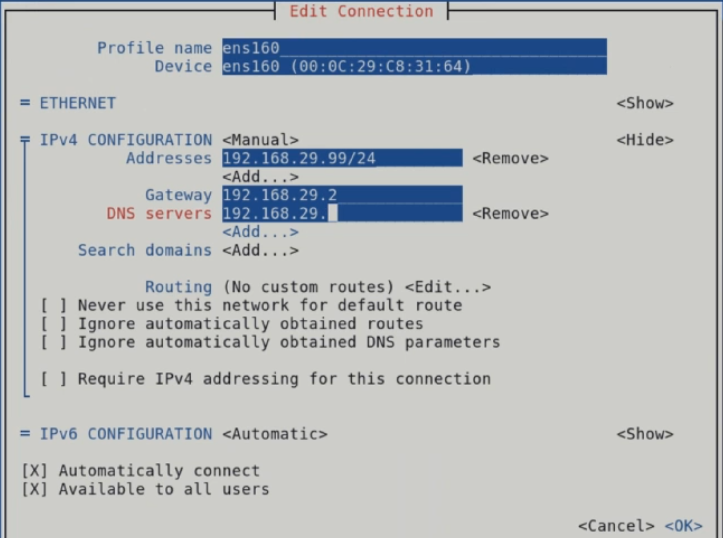

# Networking

## Notes

Do not use ifconfig anymore. It's been deprecated for over 20 years now.
Ifconfig does not support secondary ip addresses for example.

## See information for your NIC

### Display IP addresses
``ip ad`` or ``nmcli``

### Display route/gateway information
``ip -4 route``
``ip -6 route``

Legacy command to see route information.
``netstat -rn`` or ``route -n``

### Display ARP table
``arp -a``

### Display the ARP default timeout
``cat cat /proc/sys/net/ipv4/neigh/default/gc_stale_time``

## Change settings for your NIC

### Assign IP address

You can use the "graphical" ``nmtui`` tool to configure your network connection. If you use ``nmtui``, remember to **set the subnet mask** when you enter the ip address. Using ``nmtui`` for the exam is better, it will save time.

Another way is to use the ``nmcli`` tool. Remember to swap out the name for the correct name you see when you execute ``nmcli connection show``
 ``nmcli connection edit enp1s0``

Now you are in the nmcli interface. Type ``print`` to see detailed information for the connection named "enp1s0". To see the name of all your connection, ``nmcli connection show`` and ``nmcli device show``

Find the connection name, ``nmcli connection show``
Make sure that the **bash-completion package** is installed when working with nmcli.

Assign the IP address to the correct connection name.
``nmcli connection modify enp0s3 ipv4.addresses 192.168.1.21/24``

ip is an excellent command for troubleshooting but using the ip command only changes runtime environment, **it does not change anything in the configuration files.**

Here are a few nmcli examples:

``nmcli device status`` \
``nmcli connection show -active`` \

**Activate Changes** \
``nmcli connection reload`` \
This only makes the NM aware of the changes. \
You have to take the connection down and then up (``nmcli con down NAME; nmcli con up NAME``) or most changes can be applied directly with ``nmcli dev reapply NAME``

## Change the gateway

``nmcli connection modify enp0s3 ipv4.gateway 192.168.1.254``

## Use static instead of DHCP

``nmcli connection modify enp0s3 ipv4.method static``

### Disabling and enabling an interface
``ip link set ens33 down``
``ip link set ens33 up``

### Changing the MTU for e.g., iSCSI
- ``nmcli con mod ensp92 802-3-ethernet.mtu 9000``

## Debug

Use ``nm-connection-editor`` if you have issues with certs for you network cards.