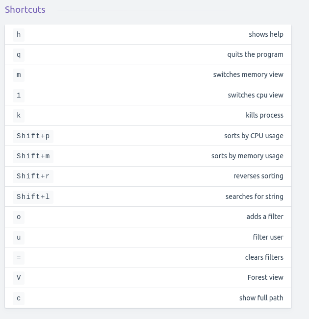

# Managing processes

## General notes

Use cgroups instead of nice and renice to manage processes.

To list, read, and set kernel tunables.
``sysctl -a``

To make system tuning easier, use ``tuned``
``tuned`` is a systemd service that works with different profiles.
``tuned-adm list`` shows current profiles.

## General commands

**Find process by name**
``pidof processname``
``pgrep processname``
``ps aux | grep 'firefox'``

**Show hierarchical relations between processes**
``ps -fax``

**Show all processes owned by armann**
``ps -fU armann``

**Shows a process tree for a specific process**
``ps -d --forest -C sshd``

## Working with TOP

