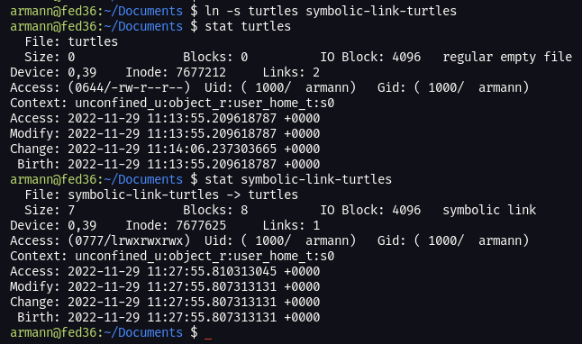
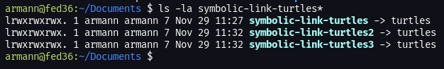
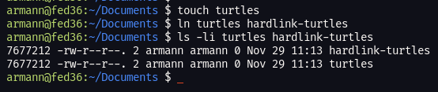
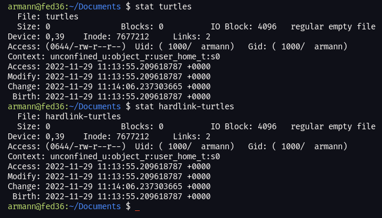

# Random Notes

## Bash completion

Install bash completion on the exam if it's missing.
``sudo dnf install bash-completion``

## Sudo

Extend the auth token for sudo. The default is 5 minutes. Put this line into "/etc/sudoers" file. 60, equals 60 minutes.

``Defaults timestamp_type=global,timestamp_timeout=60``

## Hard and symbolic links

*Symbolic links can be made to both directories and files. Hard links can only be made to files on the same filesystem and not directories.*

Use that ``stat`` command to see information about the file. Such as its **Inode** number and whether it's a symbolic link or a hard link.

To create a symbolic link. ``ln -s filenameIwant2link2 symboliclinkfilename``
To create a hard link. ``ln filenameIwant2link2 hardlinkfilename``

### Symbolic Links ###
The best way to understand symbolic links is like a shortcut in Windows or whatever it's called in MacOs. Probably shortcut as well. :) It has a seperate Inode number and if you delete the file the symbolic link (shortcut) is pointing to, the symbolic link will no longer work.

Here we create a symbolic link to the file "turtles". ``stat turtles`` "Links: 2" refers to the number of hard links pointing to the Inode number behind "turtles". For ``stat symbolic-link-turtles`` you can see it tells us it's a symbolic link and it's set to "Links: 1".

You can also see if it's a symbolic link by doing ls -l. The "l" at the beginning of "lrwxrwxrwx" tells us it's a symbolic link.

### Hard Links ###
The best way to understand hard links is by thinking of it as two or more files sharing the same Inode number. If you edit one of the files that points to the same Inode number, you edit them all. If you have multiple files pointing to the same Inode number, you can delete one of the files and it will have no effect on the rest.

Let's create a file "turtles", and then a hard link named turtles-hardlink.

You can see the same Inode number, "7677212". After the permissions you see the number "2". This is telling us how many links are to the current Inode number.

You can edit either file and both will change, you can also delete "turtles" and it will have no effect on "hardlink-turtles". 

