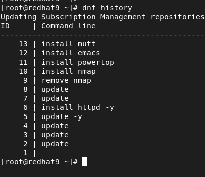
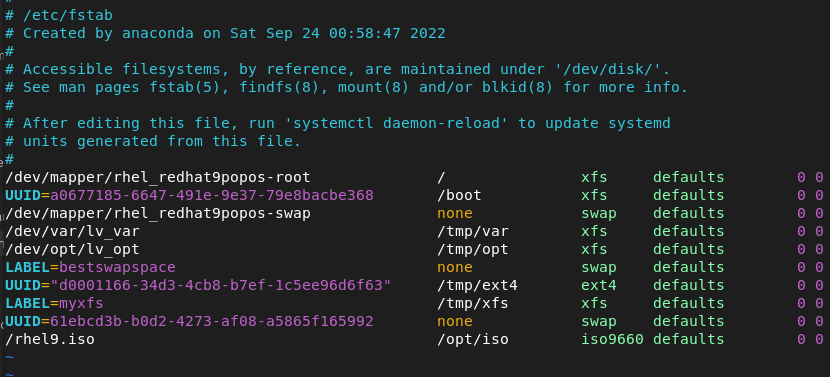

# Software management

## Common DNF commands

``dnf repolist`` \
``dnf provides htop`` or ``dnf provides */Containerfile`` \
``dnf search htop`` \
``dnf search all htop`` \
``dnf update`` The same as ``dnf upgrade``. The "update" is an alias for "upgrade". \
``dnf group install`` Only mandatory and default packages are installed, to see optional packages use ``dnf group info`` and to install with all optional packages do ``dnf group install --with-optional`` \
``dnf group list`` See group packages that you can install. \
``dnf group list hidden`` Some groups are normally only installed through environment groups and not separately, and for that reason don't show when using ``dnf group list``

### History
``dnf history``
``dnf history info 10`` 

### Rollback and undo
``dnf history undo 10``
``sudo dnf history rollback 10`` Let's say you want to undo everything that was installed after number 10. This command seen below would remove mutt, emacs and powertop.

To reinstall something that was removed. \
``dnf history redo 15``

## Repository management during exam

During the exam your virtual machine **will not have access to the internet**. Hence, we cannot use subscription-manager and associated repos. **No repositories will be available by default**. This means we cannot install any packages by default.

Red Hat will tell you that a repository is available at a certain location, and you will have to configure the repository for that manually.

You need to be capable of configuring repository access, or you will **fail the exam**.

### Use subscription manager repositories
This is just and FYI. **You will not** have access to these repositories during the exam!.
To access repositories that are offered through subscription manager, use ``dnf config-manager --enable name-of-the-repository`` to add repository access.

### Create a repository locally
To enable third party repositories, create a repo files in "/etc/yum.repos.d/". 

Let's create a local repository from the RHEL 9 ISO file.
I mount the RHEL 9 ISO in the virtual cdrom drive.
For me, it's mounted on "/run/media/armann/RHEL-9-0-0-BaseOS-x86_64".

If you need to mount the cdrom manually. ``mount /dev/sr0 /mnt``

Let's copy the iso file to our computer. Make sure you have around 9GB available            
on the root of your hard disk. ``dd if=/dev/sr0 of=/rhel9.iso bs=1M``

Let's edit "/etc/fstab" so it's mounted automatically for us. You can see the last line, that's how we mount the rhel9.iso automatically after boot.

Let's mount it.  ``mount -a``

Now we need to manually create the repository file. \
Go under "/etc/yum.repos.d/". \
Create a file, ``vim baseos.repo``

Let's add the following lines into baseos.repo.

[baseos] \
name=baseos \
baseurl=file:///opt/iso/BaseOS \
gpgcheck=0

**Create another repo file.** \
Call it appstream.repo

[appstream] \
name=appstream \
baseurl=file:///opt/iso/AppStream \
gpgcheck=0 

Now we can check to see if our repository file is okay. \
``dnf repolist`` \
We should see baseos and appstream and no errors.

## DNF Modules

**BaseOS repo** is for packages that don't change during the lifecycle of the OS.
The **AppStream repo** is for packages that do change major versions during
the lifecycle period of the Os.

## Subscription

To see all the software you are entitled to use with the subscription attached to the machine.

``rct cat-cert /etc/pki/entitlement/5715597599610761455.pem``
