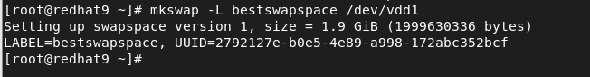

# Storage

---

## General notes

### Deleting partitions
Deleting partitions in Fdisk does not delete the data on the partition. The only thing that's deleted is a line in the partition table. If you delete a partition in order to extend it, when you create a new one, Fdisk asks "*Do you want to remove the signature? [Y]es/[N]o"*
Select **no**, otherwise you will delete all data on the partition.

### Listing devices
To see disks and partitions. ``lsblk``
If for some reason you don't think that is correct you can ``cat /proc/partitions``

---

## Mount

This command checks the "/etc/fstab" file is valid.
``findmnt --verify`` 

To mount all unmounted devices.
``mount -a``

*During the exam, reboot the machine to verify all mounts!*
If your system can't boot because of a problem with "/etc/fstab" you will fail the exam.

In datacenter environments, block device names may change. Different solutions exist for persistent naming.

- **UUID**: a UUID is automatically generated for each device that contains a filesystem or anything similar.
- **Label**: while creating the filesystem, the option ``-L`` can be used to set an arbitrary name that can be used for mounting the filesystem.

To set a label on an XFS filesystem you can use ``xfs_admin -L mygreatlabel /dev/sda6`` To label it the volume needs to be unmounted. In "/etc/fstab" the **first field** would be ``LABEL=mygreatlabel`` instead of "/dev/sda6."

If you want to mount it based on UUID, you can find the UUID with ``blkid``.

---

## Swap

1. Create the parition. Partitions types are important on the exam. In Fdisk remember to set the type to swap.
2. Set up a Linux swap area on the device or file we created. ``mkswap /dev/vdd1`` You could also do ``mkswap -L myswapspace /dev/vdd1`` and use the label to mount it in fstab.
3. Mount the swap space in "/etc/fstab". In the first field you can use /dev/vdd1 or the UUID, or the label if you created one. 
4. In the "/etc/fstab" file remember to mount the swap file to **none** and set the filesystem as swap.
5. To activate the swap run ``swapon -a`` 
6. Check out the new swap space ``free -h``

If you have multiple swap files you can see the priority with ``swapon -s``

---

