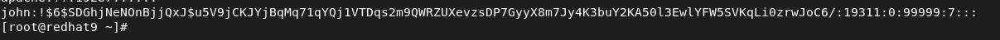

# Users and Groups

## Users 

### Adding users

``useradd john`` to create user john.
Checkout useradd --help to see more available options.

Files in **/etc/default/useradd** apply to useradd only.  
Alternatively, write default settings to **/etc/login.defs**. This is the main settings config file.

Changing this will not affect previously created users, only users that will be created in the future.

Files in **/etc/skel** are copied to the user home directory upon creation. If we want to send a message, scripts, etc. We can use **/etc/skel**.

## Managing users

### Passwords
To view password settings for user John.
``chage -l john``

To set password options for John.
``chage john``

You can also view the password options in **/etc/shadow**. You can see if the user account is locked out. The second field is the password hash. If the password hash starts with **!** The user account is locked out. As you can see, the user John is locked out.

You can also see if the account is locked with ``passwd -S armann`` 

If you want to transfer a password from another server to another one, simply copy the password hash in **/etc/shadow** from the server with the correct password and paste it into field number 2. 

To edit **/etc/passwd** use ``vipw``. Do not edit the file directly.

### User account management

To lock a user account.
``usermod -L john``

To unlock an account.
``usermod -U john``

See previous logged in users.
``last``

See currently logged in users.
``w`` or ``who``

### User file management

**/etc/login.defs**: Used for default settings like UID settings, passwd default settings, and other things.

**/etc/profile**: Used for default settings for all users when starting a login shell.

**/etc/bashrc**: Used to define defaults for all users when starting a subshell.

**~/.profile**: Specific settings for one user applied when starting a login shell.

**~/.bashrc**: Specific settings for one user applied when starting a subshell.

## Groups

To create a new group. ``groupadd groupname``

To see members of a group. ``groupmems -g sales`` or ``lid -g groupname``. For a specific user you can use ``id john`` or ``groups john``. The first group listed is the primary group.

Add John to the group sales. ``usermod -aG sales john``. The new group for the user is applied when they log out and back in. If they don't want to do that and use the new group right away, that's when we use the ``newgrp`` command. Remember to use the ``-a`` option when adding people to groups. If you don't, it will **override** all secondary groups the member is a part of.

Remove user John from the group printers.
``gpasswd -d john printers``

You can use ``newgrp sales`` to change the primary group to sales. This is only a **temporary** primary group change, when you exit, it's back to your original primary group. Remember that the ``newgrp`` command opens a subshell where the user is a member of the group sales.

Use ``vigr`` to change the **/etc/groups** file.  

See all groups `cat /etc/group`

## SUDO 

To have sudo rights the user needs to be a part of the wheel group.

To see current members of the wheel group.

``lid -g wheel``

Let's add John to the wheel group. ``usermod -aG wheel john``

Let's remove John from the wheel group. ``gpasswd -d john wheel``
